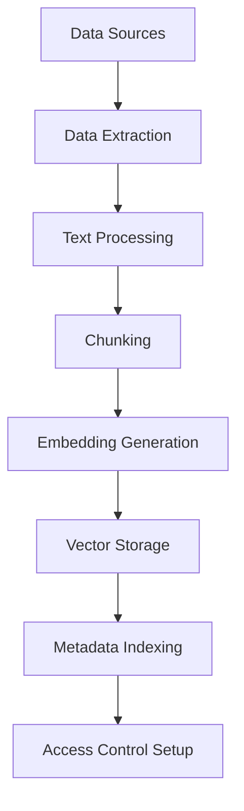
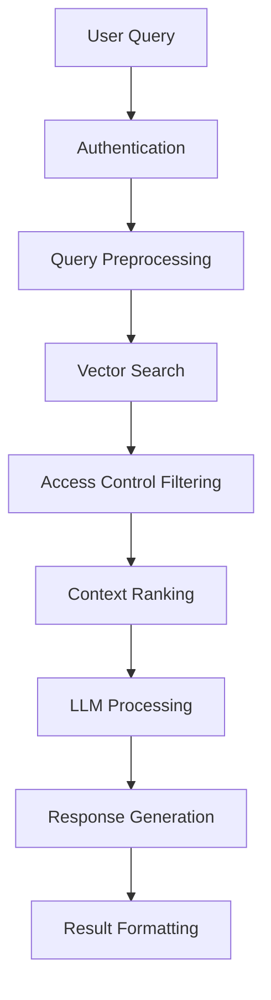
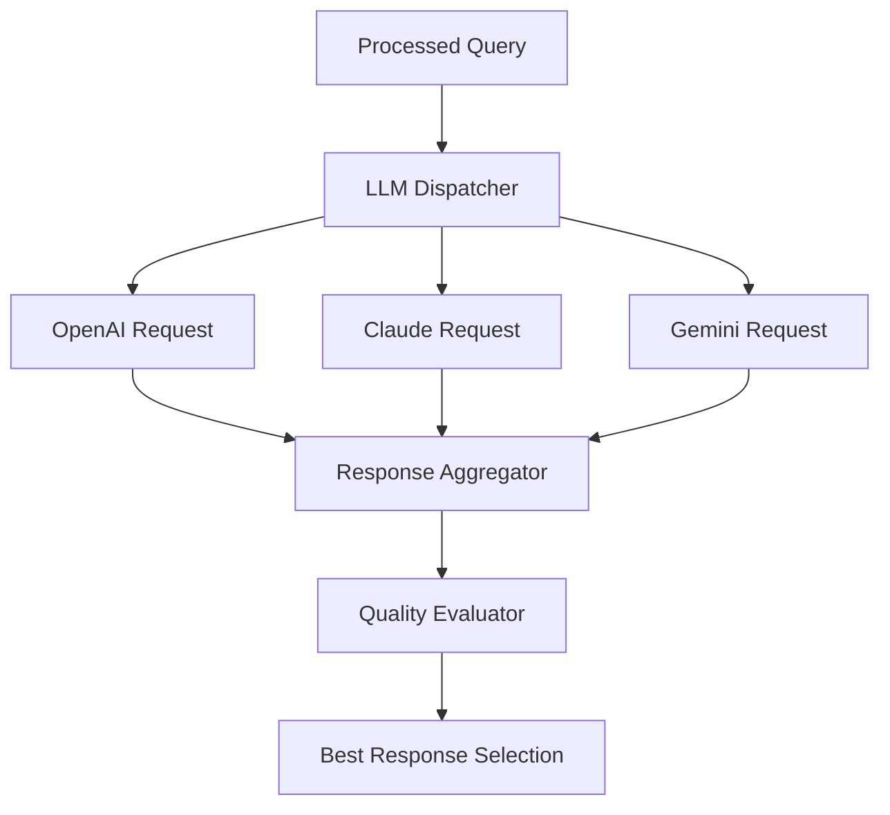

# System Architecture

This document provides a comprehensive overview of the RAG Server architecture, including component design, data flow, and integration patterns.

## Table of Contents

- [Overview](#overview)
- [System Components](#system-components)
- [Data Flow](#data-flow)
- [Database Schema](#database-schema)
- [API Design](#api-design)
- [Security Architecture](#security-architecture)
- [Deployment Architecture](#deployment-architecture)
- [Performance Considerations](#performance-considerations)

## Overview

The RAG Server is designed as a modular, scalable system that combines multiple data sources with vector search capabilities and multi-LLM integration. The architecture follows a layered approach with clear separation of concerns.

### High-Level Architecture

```
┌─────────────────────────────────────────────────────────────────┐
│                      Client Layer                               │
│  ┌─────────────────┐  ┌─────────────────┐  ┌─────────────────┐  │
│  │   Web Client    │  │   CLI Client    │  │   API Client    │  │
│  └─────────────────┘  └─────────────────┘  └─────────────────┘  │
└─────────────────────────────────────────────────────────────────┘
                                 │
                                 ▼
┌─────────────────────────────────────────────────────────────────┐
│                      API Layer                                  │
│  ┌─────────────────┐  ┌─────────────────┐  ┌─────────────────┐  │
│  │   REST API      │  │   Auth API      │  │   Admin API     │  │
│  │   (FastAPI)     │  │   (JWT)         │  │   (Management)  │  │
│  └─────────────────┘  └─────────────────┘  └─────────────────┘  │
└─────────────────────────────────────────────────────────────────┘
                                 │
                                 ▼
┌─────────────────────────────────────────────────────────────────┐
│                    Business Logic Layer                         │
│  ┌─────────────────┐  ┌─────────────────┐  ┌─────────────────┐  │
│  │   RAG Engine    │  │   Auth Manager  │  │   Config Mgmt   │  │
│  └─────────────────┘  └─────────────────┘  └─────────────────┘  │
│  ┌─────────────────┐  ┌─────────────────┐  ┌─────────────────┐  │
│  │   Data Pipeline │  │   LLM Manager   │  │   Access Control│  │
│  └─────────────────┘  └─────────────────┘  └─────────────────┘  │
└─────────────────────────────────────────────────────────────────┘
                                 │
                                 ▼
┌─────────────────────────────────────────────────────────────────┐
│                    Data Access Layer                            │
│  ┌─────────────────┐  ┌─────────────────┐  ┌─────────────────┐  │
│  │   Vector DB     │  │   Relational DB │  │   File System   │  │
│  │   (Milvus)      │  │   (PostgreSQL)  │  │   (Local/Cloud) │  │
│  └─────────────────┘  └─────────────────┘  └─────────────────┘  │
└─────────────────────────────────────────────────────────────────┘
                                 │
                                 ▼
┌─────────────────────────────────────────────────────────────────┐
│                    External Services                            │
│  ┌─────────────────┐  ┌─────────────────┐  ┌─────────────────┐  │
│  │   OpenAI API    │  │   Claude API    │  │   Gemini API    │  │
│  └─────────────────┘  └─────────────────┘  └─────────────────┘  │
│  ┌─────────────────┐  ┌─────────────────┐  ┌─────────────────┐  │
│  │   Ollama Local  │  │   Embedding API │  │   Other APIs    │  │
│  └─────────────────┘  └─────────────────┘  └─────────────────┘  │
└─────────────────────────────────────────────────────────────────┘
```

## System Components

### 1. Core Application (`src/core/`)

#### App Factory (`app.py`)
- FastAPI application factory
- Middleware configuration
- Lifecycle management
- Route registration

#### Configuration Management (`config.py`)
- Environment-based configuration
- YAML/JSON config file support
- Environment variable override
- Validation and type checking

#### Exception Handling (`exceptions.py`)
- Custom exception hierarchy
- HTTP status code mapping
- Error response formatting

#### Logging (`logging.py`)
- Structured logging with loguru
- Component-specific loggers
- File and console output
- Log rotation and retention

### 2. API Layer (`src/api/`)

#### REST API Endpoints
- Query processing endpoints
- User management endpoints
- System administration endpoints
- Health check endpoints

#### Request/Response Models
- Pydantic models for validation
- OpenAPI schema generation
- Input sanitization
- Response formatting

#### Middleware
- CORS handling
- Authentication middleware
- Rate limiting
- Request logging

### 3. RAG Engine (`src/rag/`)

#### Query Processing
- Query preprocessing
- Vector similarity search
- Context ranking
- Response generation

#### Multi-LLM Support
- LLM provider abstraction
- Load balancing
- Failover handling
- Response aggregation

#### Access Control Integration
- Permission validation
- Result filtering
- Audit logging

### 4. Database Layer (`src/database/`)

#### Connection Management (`base.py`)
- SQLAlchemy engine and connection pooling
- Context managers for connections and transactions
- Event listeners for connection lifecycle management
- Health checking and pool status monitoring

#### Multi-Database Support (`drivers.py`)
- PostgreSQL, MySQL, MariaDB, Oracle, SQL Server drivers
- Database-specific connection URLs and engine options
- Driver factory pattern for easy extension
- Health check queries tailored for each database type

#### Advanced Connection Pooling (`pool.py`)
- Connection pool with comprehensive monitoring
- Pool metrics collection and performance tracking
- Event listeners for connection lifecycle events
- Pool manager for handling multiple database connections

#### Schema Intelligence (`introspection.py`)
- Comprehensive database schema analysis
- Table, column, index, and relationship detection
- Sample data extraction and JSON export capabilities
- Database relationship mapping and analysis

#### Health Monitoring (`health.py`)
- Multi-level health checking system
- Connection ping testing with timeout handling
- Pool validation and configuration verification
- Schema validation and permission checking
- Comprehensive health reporting with metrics

#### Error Handling & Resilience (`retry.py`)
- Intelligent error classification and retry logic
- Circuit breaker pattern for fault tolerance
- Multiple retry strategies (linear, exponential, fibonacci)
- Connection invalidation and pool recovery
- Comprehensive error metrics and monitoring

#### Data Pipeline Components
- RDB data extraction with robust error handling
- File system scanning with change detection
- Text processing and chunking capabilities
- Vector generation with embedding model integration

### 5. Authentication & Authorization (`src/auth/`)

#### JWT Token Management
- Token generation
- Token validation
- Refresh token handling
- Session management

#### Role-Based Access Control
- User roles and permissions
- Resource-level access control
- Fine-grained permissions
- Policy enforcement

#### Integration with Milvus RBAC
- User mapping
- Permission synchronization
- Row-level security
- Audit trail

### 6. LLM Integration (`src/llm/`)

#### Provider Abstraction
- Common interface for all LLMs
- Configuration management
- Error handling
- Response standardization

#### Supported Providers
- OpenAI (GPT models)
- Anthropic (Claude models)
- Google (Gemini models)
- Ollama (local models)

#### Multi-LLM Orchestration
- Parallel processing
- Response evaluation
- Best answer selection
- Performance monitoring

### 7. Vector Database Integration (`src/embeddings/`)

#### Milvus Management
- Collection management
- Index optimization
- Query processing
- Performance tuning

#### Embedding Models
- OpenAI embeddings
- Sentence Transformers
- HuggingFace models
- Custom models

#### Vector Operations
- Similarity search
- Batch operations
- Metadata filtering
- Result ranking

## Data Flow

### 1. Data Ingestion Flow



### 2. Query Processing Flow



### 3. Multi-LLM Processing



## Database Schema

### 1. Application Database (PostgreSQL)

```sql
-- Users table
CREATE TABLE users (
    id UUID PRIMARY KEY DEFAULT gen_random_uuid(),
    username VARCHAR(255) UNIQUE NOT NULL,
    email VARCHAR(255) UNIQUE NOT NULL,
    password_hash VARCHAR(255) NOT NULL,
    role VARCHAR(50) NOT NULL DEFAULT 'user',
    is_active BOOLEAN DEFAULT true,
    created_at TIMESTAMP DEFAULT CURRENT_TIMESTAMP,
    updated_at TIMESTAMP DEFAULT CURRENT_TIMESTAMP
);

-- Data sources table
CREATE TABLE data_sources (
    id UUID PRIMARY KEY DEFAULT gen_random_uuid(),
    name VARCHAR(255) NOT NULL,
    type VARCHAR(50) NOT NULL, -- 'rdb', 'file'
    config JSONB NOT NULL,
    is_active BOOLEAN DEFAULT true,
    last_sync TIMESTAMP,
    created_at TIMESTAMP DEFAULT CURRENT_TIMESTAMP,
    updated_at TIMESTAMP DEFAULT CURRENT_TIMESTAMP
);

-- Documents table
CREATE TABLE documents (
    id UUID PRIMARY KEY DEFAULT gen_random_uuid(),
    source_id UUID REFERENCES data_sources(id),
    title VARCHAR(255) NOT NULL,
    content TEXT,
    metadata JSONB,
    file_path VARCHAR(1000),
    file_hash VARCHAR(64),
    chunk_count INTEGER DEFAULT 0,
    indexed_at TIMESTAMP,
    created_at TIMESTAMP DEFAULT CURRENT_TIMESTAMP,
    updated_at TIMESTAMP DEFAULT CURRENT_TIMESTAMP
);

-- Permissions table
CREATE TABLE permissions (
    id UUID PRIMARY KEY DEFAULT gen_random_uuid(),
    user_id UUID REFERENCES users(id),
    resource_type VARCHAR(50) NOT NULL, -- 'document', 'source', 'collection'
    resource_id UUID NOT NULL,
    permission_type VARCHAR(50) NOT NULL, -- 'read', 'write', 'admin'
    granted_by UUID REFERENCES users(id),
    created_at TIMESTAMP DEFAULT CURRENT_TIMESTAMP
);
```

### 2. Vector Database (Milvus)

```python
# Collection schema
collection_schema = {
    "collection_name": "rag_vectors",
    "fields": [
        {"name": "id", "type": "varchar", "max_length": 36, "is_primary": True},
        {"name": "vector", "type": "float_vector", "dim": 1536},
        {"name": "document_id", "type": "varchar", "max_length": 36},
        {"name": "chunk_id", "type": "varchar", "max_length": 36},
        {"name": "content", "type": "varchar", "max_length": 65535},
        {"name": "metadata", "type": "json"},
        {"name": "user_id", "type": "varchar", "max_length": 36},
        {"name": "source_id", "type": "varchar", "max_length": 36},
        {"name": "permissions", "type": "json"},
        {"name": "created_at", "type": "int64"}
    ]
}

# Index configuration
index_params = {
    "index_type": "IVF_FLAT",
    "metric_type": "IP",
    "params": {"nlist": 2048}
}
```

## API Design

### 1. Authentication Endpoints

```
POST /auth/login
POST /auth/logout
POST /auth/refresh
GET  /auth/me
```

### 2. Query Endpoints

```
POST /query              # Main RAG query endpoint
POST /query/batch        # Batch query processing
GET  /query/{query_id}   # Get query results
```

### 3. Data Management Endpoints

```
POST /data/sources          # Add data source
GET  /data/sources          # List data sources
PUT  /data/sources/{id}     # Update data source
DELETE /data/sources/{id}   # Remove data source
POST /data/sync/{id}        # Trigger sync
```

### 4. User Management Endpoints

```
POST /users              # Create user
GET  /users              # List users
PUT  /users/{id}         # Update user
DELETE /users/{id}       # Delete user
POST /users/{id}/permissions  # Set permissions
```

### 5. System Endpoints

```
GET /health              # Health check
GET /metrics             # System metrics
GET /config              # Configuration
POST /admin/reindex      # Reindex data
```

## Security Architecture

### 1. Authentication Layer

- JWT-based authentication
- Token expiration and refresh
- Secure password hashing (bcrypt)
- Multi-factor authentication support

### 2. Authorization Layer

- Role-based access control (RBAC)
- Resource-level permissions
- Fine-grained access control
- Policy-based authorization

### 3. Data Protection

- Encryption at rest and in transit
- Input validation and sanitization
- SQL injection prevention
- XSS protection

### 4. Network Security

- CORS configuration
- Rate limiting
- IP whitelisting
- SSL/TLS enforcement

## Deployment Architecture

### 1. Container Architecture

```dockerfile
# Multi-stage build
FROM python:3.11-slim as builder
# Build dependencies and create wheel

FROM python:3.11-slim as runtime
# Runtime dependencies and application
```

### 2. Service Dependencies

```yaml
services:
  rag-server:
    image: rag-server:latest
    depends_on:
      - postgres
      - milvus
      - redis
    environment:
      - APP_ENV=production
      - DB_HOST=postgres
      - MILVUS_HOST=milvus
      - REDIS_HOST=redis

  postgres:
    image: postgres:15
    environment:
      - POSTGRES_DB=ragdb
      - POSTGRES_USER=raguser
      - POSTGRES_PASSWORD=ragpass

  milvus:
    image: milvusdb/milvus:v2.3.0
    depends_on:
      - etcd
      - minio

  redis:
    image: redis:7-alpine
```

### 3. Scaling Strategy

- Horizontal scaling with load balancer
- Database read replicas
- Milvus cluster deployment
- Caching layer (Redis)

## Performance Considerations

### 1. Vector Search Optimization

- Index type selection (IVF_FLAT, HNSW)
- Batch size optimization
- Memory management
- Query parallelization

### 2. Database Optimization

#### Connection Management
- Advanced connection pooling with monitoring
- Multi-database support (PostgreSQL, MySQL, MariaDB, Oracle, SQL Server)
- Connection pool metrics and performance tracking
- Automatic connection lifecycle management

#### Resilience & Error Handling
- Intelligent error classification and retry mechanisms
- Circuit breaker pattern for fault tolerance
- Multiple retry strategies (linear, exponential, fibonacci)
- Connection invalidation and pool recovery
- Comprehensive error metrics and monitoring

#### Health Monitoring
- Multi-level health checking system
- Connection ping testing with timeout handling
- Pool validation and configuration verification
- Schema validation and permission checking

#### Performance Features
- Connection pool optimization with LIFO queuing
- Pre-ping for pessimistic disconnect detection
- Pool recycle configuration for long-running connections
- Event-driven connection monitoring and metrics

### 3. Caching Strategy

- Query result caching
- Embedding caching
- Configuration caching
- User session caching

### 4. Monitoring and Observability

- Application metrics
- Database performance
- Vector search metrics
- LLM API usage

## Implementation Progress

### ✅ Task 1: Project Setup and Configuration
- [x] Project structure and dependencies (`pyproject.toml`)
- [x] Core configuration management (`src/core/config.py`)
- [x] Exception handling framework (`src/core/exceptions.py`)
- [x] Logging system (`src/core/logging.py`)

### ✅ Task 2: Database Connection Management
- [x] **Task 2.1**: SQLAlchemy Base Setup (`src/database/base.py`)
  - SQLAlchemy engine and connection pooling
  - Context managers for connections and transactions
  - Event listeners for connection lifecycle management
  
- [x] **Task 2.2**: Multi-Database Driver Implementation (`src/database/drivers.py`)
  - PostgreSQL, MySQL, MariaDB, Oracle, SQL Server drivers
  - Database-specific connection URLs and engine options
  - Driver factory pattern for easy extension
  
- [x] **Task 2.3**: Connection Pooling with Configuration (`src/database/pool.py`)
  - Advanced connection pool with comprehensive monitoring
  - Pool metrics collection and performance tracking
  - Event listeners for connection lifecycle events
  
- [x] **Task 2.4**: Schema Detection and Introspection (`src/database/introspection.py`)
  - Comprehensive database schema analysis
  - Table, column, index, and relationship detection
  - Sample data extraction and JSON export capabilities
  
- [x] **Task 2.5**: Health Checks and Validation (`src/database/health.py`)
  - Multi-level health checking system
  - Connection ping testing with timeout handling
  - Pool validation and configuration verification
  
- [x] **Task 2.6**: Error Handling with Retries (`src/database/retry.py`)
  - Intelligent error classification and retry logic
  - Circuit breaker pattern for fault tolerance
  - Multiple retry strategies and connection recovery

### 🔄 Next Tasks (From TaskMaster)
- [ ] **Task 3**: Milvus Vector Database Integration
- [ ] **Task 4**: LLM Integration Framework
- [ ] **Task 5**: Embedding Model Integration
- [ ] **Task 6**: Data Pipeline Development
- [ ] **Task 7**: Access Control System
- [ ] **Task 8**: RAG Query Processing Engine
- [ ] **Task 9**: FastAPI Application Framework
- [ ] **Task 10**: Authentication and Authorization
- [ ] **Task 11**: CLI Management Interface
- [ ] **Task 12**: Testing Framework
- [ ] **Task 13**: Documentation System
- [ ] **Task 14**: Docker Deployment
- [ ] **Task 15**: Performance Optimization

### Implementation Status Summary
- **Completed**: 2/15 tasks (13.3%)
- **In Progress**: Database layer fully implemented with production-ready features
- **Next Focus**: Vector database integration and LLM framework

---

This architecture provides a solid foundation for a scalable, secure, and maintainable RAG system that can handle enterprise-level requirements while maintaining flexibility for future enhancements.